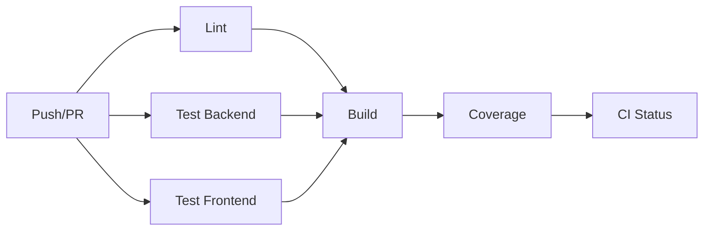
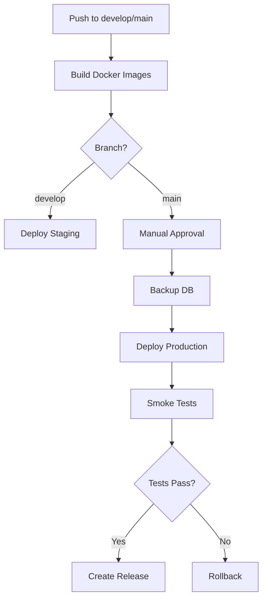

# CI/CD Pipeline - Guelaguetza Connect

## Status Badges


[](https://codecov.io/gh/marxchavez/guelaguetza-connect)

## Overview

Este proyecto utiliza GitHub Actions para automatizar CI/CD con los siguientes workflows:

### 1. CI Workflow (`ci.yml`)

**Triggers:**
- Push a cualquier branch
- Pull requests a `main` o `develop`

**Jobs:**
1. **Lint** - Verificación de código TypeScript
2. **Test Backend** - Tests unitarios e integración con PostgreSQL y Redis
3. **Test Frontend** - Tests unitarios del frontend
4. **Build** - Compilación en Node 18, 20 y 22
5. **Coverage** - Reporte de cobertura (Codecov)

**Duración estimada:** 10-15 minutos

### 2. Deploy Workflow (`deploy.yml`)

**Triggers:**
- Push a `develop` → Deploy automático a Staging
- Push a `main` → Deploy a Producción (requiere aprobación manual)
- Workflow manual dispatch

**Jobs:**
1. **Build Images** - Construcción de imágenes Docker
2. **Deploy Staging** - Deployment automático a staging
3. **Deploy Production** - Deployment a producción con aprobación
4. **Post Deploy** - Tareas post-deployment (releases, notificaciones)

**Features:**
- Zero-downtime deployments
- Automatic database backups antes de producción
- Rollback automático en caso de fallo
- Smoke tests post-deployment
- Notificaciones a Slack

### 3. Dependabot (`dependabot.yml`)

Actualizaciones automáticas semanales de:
- Dependencias NPM (Frontend y Backend)
- Imágenes Docker
- GitHub Actions

## Configuration

### Secrets Requeridos

Configura estos secrets en GitHub Settings → Secrets and variables → Actions:

#### General
```
GITHUB_TOKEN                 # Auto-generado por GitHub
CODECOV_TOKEN               # Token de Codecov (opcional)
```

#### Stripe (Testing)
```
STRIPE_TEST_SECRET_KEY      # Clave secreta de Stripe (test mode)
STRIPE_TEST_WEBHOOK_SECRET  # Secret para webhooks de Stripe
```

#### Staging Environment
```
STAGING_HOST                # IP/hostname del servidor staging
STAGING_USER                # Usuario SSH
STAGING_SSH_KEY             # Private SSH key
STAGING_SSH_PORT            # Puerto SSH (default: 22)
STAGING_API_URL             # URL de la API staging
```

#### Production Environment
```
PROD_HOST                   # IP/hostname del servidor producción
PROD_USER                   # Usuario SSH
PROD_SSH_KEY                # Private SSH key
PROD_SSH_PORT               # Puerto SSH (default: 22)
PROD_API_URL                # URL de la API producción
```

#### Notifications
```
SLACK_WEBHOOK_URL           # Webhook de Slack para notificaciones
```

### Environments en GitHub

Configura estos environments en GitHub Settings → Environments:

#### Staging
- No requiere aprobación
- Secrets específicos de staging
- URL: https://staging.guelaguetza-connect.com

#### Production
- **Requiere aprobación manual** de reviewers
- Secrets específicos de producción
- URL: https://guelaguetza-connect.com

## Workflow Details

### CI Pipeline



### CD Pipeline



## Usage

### Running CI Locally

```bash
# Lint
npm run lint           # Frontend
cd backend && npm run lint  # Backend (cuando se configure ESLint)

# Tests
npm run test           # Frontend unit tests
cd backend && npm run test  # Backend unit tests
cd backend && npm run test:integration  # Backend integration tests

# Build
npm run build          # Frontend
cd backend && npm run build  # Backend

# Coverage
npm run test:coverage  # Frontend
cd backend && npm run test:coverage  # Backend
```

### Deploying Manually

```bash
# Deploy a staging (push a develop)
git push origin develop

# Deploy a producción (push a main)
git push origin main
# → Espera aprobación en GitHub Actions

# Deploy manual
# GitHub → Actions → Deploy → Run workflow
```

### Cache Management

Los workflows usan cache de GitHub Actions para:
- `node_modules` de frontend y backend
- Docker layer cache
- Setup de Node.js

**Para limpiar cache:**
```bash
# Via GitHub CLI
gh cache list
gh cache delete <cache-key>
```

## Optimization Tips

### Speed Up CI

1. **Paralelización**: Los jobs se ejecutan en paralelo cuando es posible
2. **Cache**: node_modules y layers de Docker se cachean
3. **Matrix builds**: Se prueban múltiples versiones de Node en paralelo

### Reduce Costs

1. **Concurrency control**: Cancela workflows anteriores si hay uno nuevo
2. **Timeout limits**: Cada job tiene un timeout definido
3. **Conditional jobs**: Jobs solo se ejecutan cuando es necesario

## Troubleshooting

### CI Fails on Tests

1. Verifica que las service containers (PostgreSQL, Redis) estén healthy
2. Revisa los logs del job específico
3. Ejecuta los tests localmente con las mismas variables de entorno

### Deployment Fails

1. Verifica que los secrets estén configurados correctamente
2. Chequea la conectividad SSH al servidor
3. Revisa los logs del servidor de deployment
4. Si hay rollback automático, revisa los logs anteriores

### Docker Build Fails

1. Verifica que los Dockerfiles tengan el target correcto (`production`)
2. Chequea que todas las dependencias estén en `package.json`
3. Revisa que las variables de entorno estén configuradas

### Coverage Reports Not Showing

1. Verifica que `CODECOV_TOKEN` esté configurado
2. Asegúrate de que los tests generen archivos de coverage
3. Revisa la configuración de vitest para coverage

## Monitoring

### GitHub Actions Dashboard

- **Actions tab**: Ver todos los workflows
- **Insights → Actions**: Métricas de usage y performance
- **Settings → Actions**: Configuración de permisos y runners

### Deployment Status

Después de cada deployment exitoso:
- Se crea un release en GitHub (solo producción)
- Se envía notificación a Slack
- Se actualiza el status badge en README

## Best Practices

1. **Branch Protection**: Configura branch protection rules para `main` y `develop`
2. **Required Checks**: Marca CI como required check antes de merge
3. **Code Review**: Al menos un reviewer aprueba antes de merge
4. **Semantic Commits**: Usa conventional commits para mensajes claros
5. **Testing**: Mantén coverage arriba del 70%
6. **Documentation**: Actualiza README cuando cambies workflows

## Next Steps

- [ ] Configurar ESLint y agregar lint checks
- [ ] Integrar Codecov para reportes de coverage
- [ ] Configurar Slack notifications
- [ ] Agregar performance testing en CI
- [ ] Implementar blue-green deployments
- [ ] Agregar security scanning (Snyk, Dependabot)

## Resources

- [GitHub Actions Docs](https://docs.github.com/en/actions)
- [Docker Build Push Action](https://github.com/docker/build-push-action)
- [Codecov Action](https://github.com/codecov/codecov-action)
- [SSH Action](https://github.com/appleboy/ssh-action)

---

**Maintainer**: @marxchavez  
**Last Updated**: 2026-01-25
