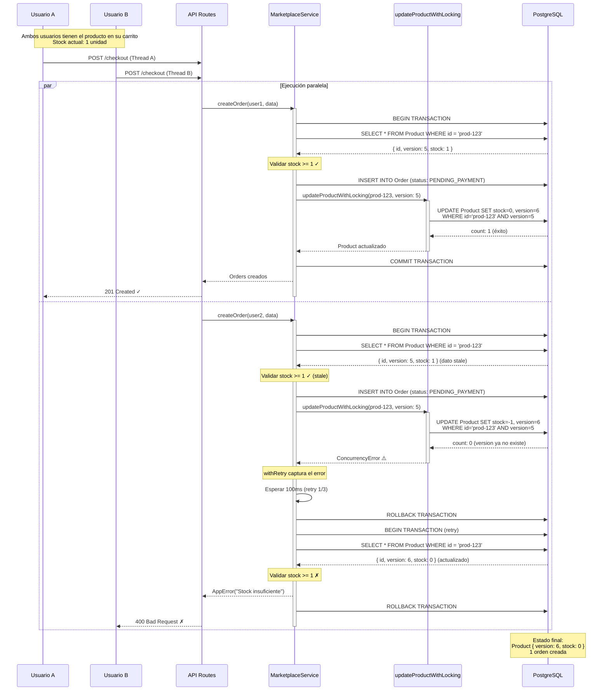
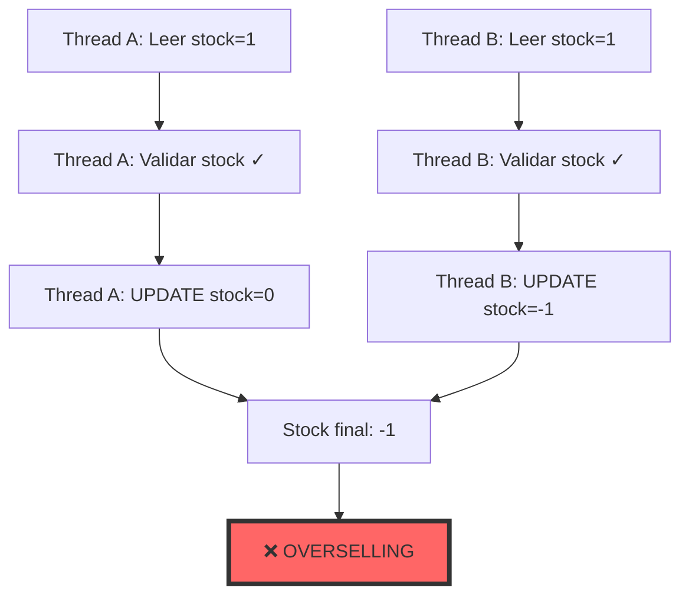
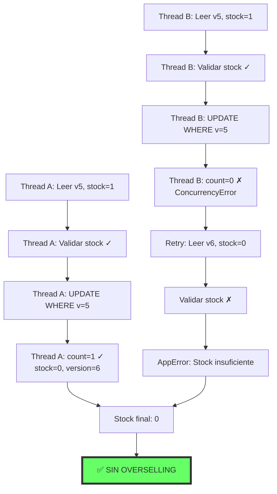
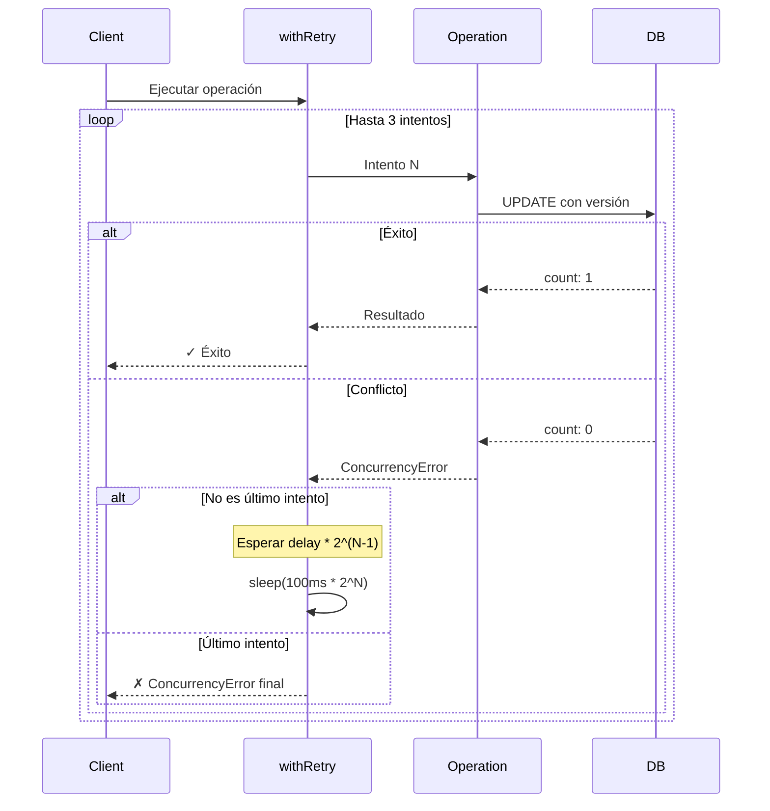
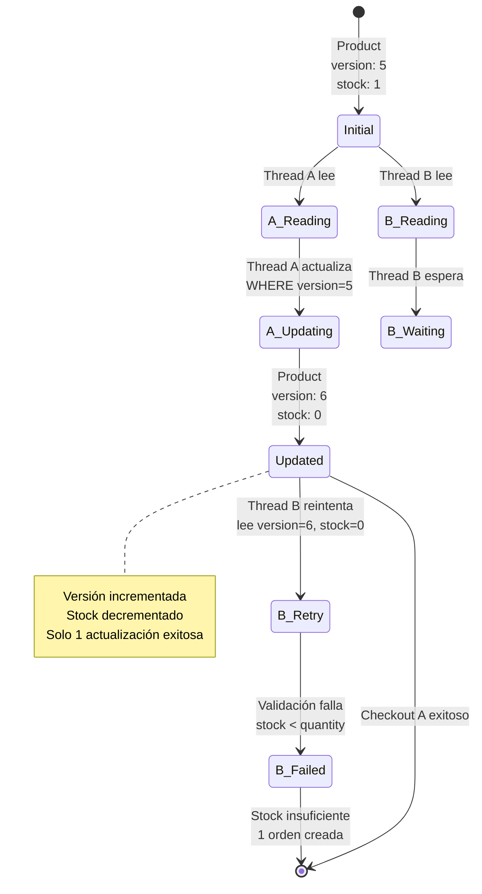
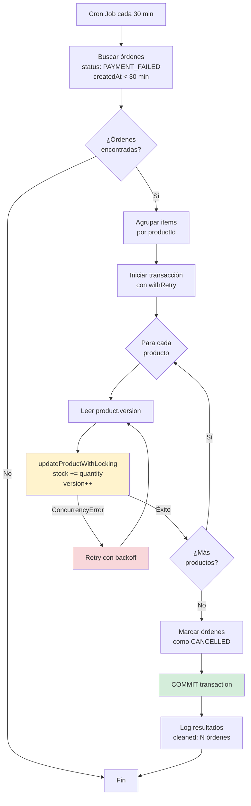
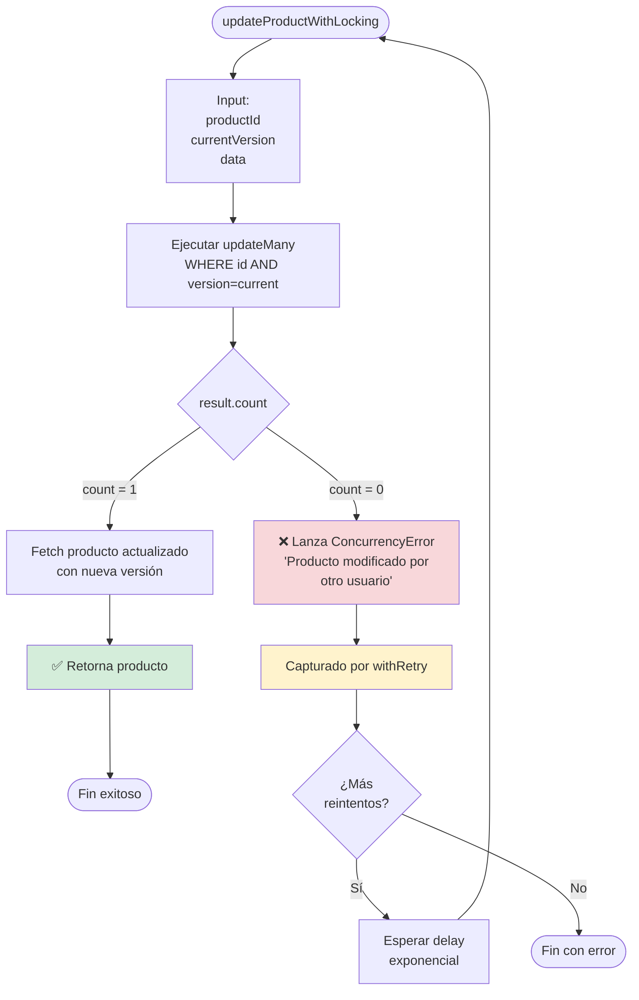

# Flujo de Optimistic Locking - Diagramas

## Diagrama 1: Flujo de Checkout con Optimistic Locking



## Diagrama 2: Comparación ANTES vs DESPUÉS

### ANTES (Sin Optimistic Locking)



### DESPUÉS (Con Optimistic Locking)



## Diagrama 3: Reintentos con Backoff Exponencial



## Diagrama 4: Arquitectura de Capas

```mermaid
graph TB
    subgraph "Frontend"
        UI[Componente Checkout]
    end

    subgraph "API Layer"
        ROUTE[marketplace.ts<br/>• Autenticación<br/>• Manejo 409]
    end

    subgraph "Service Layer"
        SVC[MarketplaceService<br/>• Lógica de negocio<br/>• Validaciones]
    end

    subgraph "Locking Layer"
        RETRY[withRetry<br/>• Reintentos automáticos<br/>• Backoff exponencial]
        UPDATE[updateProductWithLocking<br/>• Verificación de versión<br/>• Actualización atómica]
    end

    subgraph "Data Layer"
        TX[Prisma Transaction<br/>• Atomicidad<br/>• Rollback]
        DB[(PostgreSQL<br/>Product.version)]
    end

    UI -->|POST /checkout| ROUTE
    ROUTE -->|createOrder()| SVC
    SVC -->|Wrapped in| RETRY
    RETRY -->|Calls| UPDATE
    UPDATE -->|Uses| TX
    TX -->|SQL| DB

    DB -.->|ConcurrencyError| UPDATE
    UPDATE -.->|Retry| RETRY
    RETRY -.->|Success/Fail| SVC
    SVC -.->|201/409/400| ROUTE
    ROUTE -.->|Response| UI

    style DB fill:#e1f5ff,stroke:#007acc
    style UPDATE fill:#fff3cd,stroke:#ffc107
    style RETRY fill:#d4edda,stroke:#28a745
```

## Diagrama 5: Estado de Producto Durante Checkouts Concurrentes



## Diagrama 6: Cleanup de Órdenes Fallidas



## Diagrama 7: Flujo de Decisión en updateProductWithLocking



## Notas de Implementación

### Claves del Éxito:

1. **updateMany con WHERE version:** Es la clave del optimistic locking
2. **withRetry:** Maneja conflictos transitorios automáticamente
3. **Transacciones:** Garantizan atomicidad de todo el checkout
4. **Backoff exponencial:** Evita thundering herd problem

### Ventajas sobre Pessimistic Locking:

- ✅ No requiere locks explícitos en la BD
- ✅ Mejor performance en baja contención
- ✅ Más simple de implementar
- ✅ No hay deadlocks
- ✅ Compatible con réplicas de BD

### Desventajas:

- ⚠️ Puede requerir múltiples intentos en alta contención
- ⚠️ Agrega complejidad en la capa de servicio
- ⚠️ Requiere manejo de ConcurrencyError en frontend

---

**Visualizaciones generadas:** 2025-01-25
**Herramienta:** Mermaid.js
**Para renderizar:** GitHub, GitLab, o https://mermaid.live
